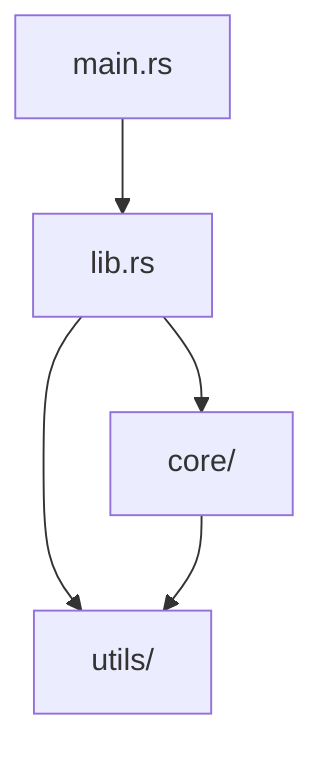

# abyss

**The LLM Context Compiler**

Transform entire codebases into semantically-ordered, token-optimized context for Large Language Models.

---

## The Problem

When you feed code to an LLM, **order matters**. Feeding files alphabetically or randomly wastes tokens and confuses the model:
- Definitions appear after usage
- Core logic buried in utilities
- High-value code mixed with boilerplate
- Token budgets filled with irrelevant files

Most tools just concatenate files. **That's not good enough.**

## The Solution

abyss is a **semantic code compiler** that intelligently analyzes your codebase and generates optimal LLM context using:

[](LICENSE)
[](https://www.rust-lang.org)

---

- **Semantic Ranking** → README first, core logic before utilities, tests last
- **Dependency Analysis** → Topological sorting ensures definitions come before usage  
- **PageRank Algorithm** → Identifies architecturally central files
- **Git Intelligence** → Prioritizes frequently-changed, high-churn files
- **Token Budget Optimization** → Knapsack algorithm fits maximum value within context limits
- **AST-Aware Compression** → Preserve interfaces, remove implementation noise

Unlike simple concatenation tools, abyss **understands your code architecture** and generates context that LLMs can actually use.

---

## How is abyss Different?

| Feature | abyss | repomix | IDE Tools |
|---------|-------|---------|-----------|
| **Ordering** | Dependency-aware topological sort | Alphabetical | Open files only |
| **Intelligence** | PageRank + git churn + semantic analysis | File tree traversal | LSP symbols |
| **Compression** | AST-aware (preserve signatures) | None | N/A |
| **Token Optimization** | Knapsack algorithm | None | Limited |
| **Use Case** | Optimal LLM context for code review, docs, refactoring | Quick file sharing | Real-time assistance |

**Not competing with memvid**: memvid is a runtime memory layer for AI agents (like RAM). abyss is a compile-time context optimizer (like a build tool). Different problems, both valuable.

[See detailed comparison →](COMPARISON.md)

---

## Quick Start

```bash
# Install
cargo install abyss

# Basic usage - scan current directory
abyss . -o context.xml

# With smart compression and token limit
abyss /path/to/repo --smart --max-tokens 128000 -o optimized.xml

# Interactive TUI mode
abyss . --tui

# Diff mode - only changed files
abyss . --diff main -o changes.xml
```

---

## Features

### Multiple Output Formats
- **XML**: Structured, parseable (default)
- **JSON**: API-friendly
- **Markdown**: Human-readable, with syntax highlighting
- **Plain Text**: Minimal overhead

### Intelligent Processing

**Semantic File Ranking**
```
README.md         → 1000 (Documentation first)
Cargo.toml        → 800  (Project config)
src/main.rs       → 700  (Entry points)
src/core/         → 600  (Core logic)
src/utils/        → 400  (Utilities)
tests/            → 100  (Tests last)
```

**Dependency-Aware Ordering**
```rust
// Abyss ensures definitions come before usage
lib.rs           // Defines module structure
  ↓
utils/mod.rs     // Shared utilities
  ↓
core/engine.rs   // Uses utilities
  ↓
main.rs          // Uses everything
```

### Smart Compression

**AST-Aware Compression** (preserves interfaces, removes implementations):
```rust
// Original
fn complex_logic(x: i32) -> i32 {
    let y = x + 1;
    println!("Calculating...");
    for i in 0..100 { /* ... */ }
    y * 2
}

// Compressed
fn complex_logic(x: i32) -> i32 { /* ... */ }
```

### Dependency Graphs

Generate Mermaid diagrams showing module relationships:
```bash
abyss . --graph -o context.md
```



### Token Budget Management

Automatically selects highest-value files within context limits:
```bash
abyss . --max-tokens 128000 -o optimized.xml
```

Dropped files are logged, showing what couldn't fit.

### Privacy & Security

Redact sensitive data automatically:
```bash
abyss . --redact -o safe.xml
```

Removes:
- API keys, tokens, secrets
- Email addresses
- Private keys
- AWS credentials

### Interactive TUI

```bash
abyss . --tui
```

Features:
- **File tree navigation** with expand/collapse
- **Live preview** with syntax highlighting  
- **Search/filter** files by name
- **Manual selection** for fine-grained control
- **Configuration** in real-time
- **Progress tracking** with ETA

---

## Usage Examples

### Basic Scan
```bash
abyss /path/to/repo -o context.xml
```

### Smart Compression + Token Limit
```bash
abyss . --smart --max-tokens 200000 -o optimized.xml
```

### Only Changed Files (Diff Mode)
```bash
abyss . --diff origin/main --format md -o changes.md
```

### With Custom Prompt
```bash
abyss . --prompt "Focus on security vulnerabilities" -o analysis.xml
```

### Copy to Clipboard
```bash
abyss . --copy --format plain
```

### Split Large Outputs
```bash
abyss . --split 100000 -o chunks.xml
# Creates: chunks-part-1.xml, chunks-part-2.xml, etc.
```

### Remote Repository
```bash
abyss https://github.com/user/repo -o remote.xml
```

### Custom Ignore Patterns
```bash
abyss . --ignore "*.test.ts" --ignore "mock_*" -o filtered.xml
```

### Include Only Specific Files
```bash
abyss . --include "src/**/*.rs" --include "Cargo.toml" -o rust-only.xml
```

---

## Configuration File

Create `abyss.toml` in your project root:

```toml
path = "."
output = "context.xml"
output_format = "Xml"  # Xml | Json | Markdown | Plain

ignore_patterns = [
    "*.test.ts",
    "mock_*",
    "*.generated.*"
]

include_patterns = []  # If set, only these files are included

max_file_size = 1_000_000  # 1MB
max_depth = 10
max_tokens = 128000

no_tokens = false
clipboard_copy = false
redact = true
compression = "Smart"  # None | Simple | Smart

[git]
diff = "main"  # Only scan changes vs. this branch
graph = true   # Generate dependency graph
```

---

## How It Works

### 1. Discovery Phase
- Traverses directory tree respecting `.gitignore`
- Applies custom ignore/include patterns
- Filters by file size and depth

### 2. **Intelligence Gathering**
```rust
For each file:
    • Calculate heuristic score (README=1000, tests=100)
    • Extract imports → build dependency graph
    • Run git blame → measure churn
    • Compute PageRank → find central files
    • Calculate entropy → measure information density
```

### 3. **Topological Sort**
- Orders files based on dependencies
- Breaks ties using combined score
- Ensures definitions before usage

### 4. **Token Budget (Optional)**
- Knapsack algorithm selects highest-value files
- Fits maximum context within limit
- Logs dropped files

### 5. **Processing**
- Parallel file reading (rayon)
- AST parsing for compression (tree-sitter)
- Concept extraction
- Summary generation
- Token counting (tiktoken)

### 6. **Output Generation**
- Streaming writes for memory efficiency
- Format-specific rendering
- Optional chunking for large outputs

---

## Advanced Features

### Executive Summaries

Automatically generated overviews:
```xml
<executive_summary>
    <purpose>High-performance web framework for Rust</purpose>
    <key_modules>
        <module path="src/server.rs" summary="HTTP server implementation" />
        <module path="src/router.rs" summary="Request routing logic" />
    </key_modules>
    <recent_changes>
        <change>Added WebSocket support</change>
        <change>Optimized connection pooling</change>
    </recent_changes>
</executive_summary>
```

### Concept Tagging

Files are tagged with extracted concepts:
```rust
// Concepts: struct AppState, fn main, fn run_server, trait Handler
```

### Binary File Handling
- **PDFs**: Text extraction via `pdf-extract`
- **Images**: Metadata description (dimensions, format)
- **Other binaries**: Skipped with logging

### Caching

Intelligent caching speeds up repeated scans:
- Hashes file content + config
- Stores token counts
- Checks modification times
- Location: `~/.cache/abyss/cache.json`

---

## Installation

### From Source
```bash
git clone https://github.com/kj/abyss
cd abyss
cargo install --path .
```

### Requirements
- Rust 1.70+
- Git (for git features)

---

## Performance

Benchmarks on a 50K LOC Rust project:

| Mode | Time | Files | Tokens | Output Size |
|------|------|-------|--------|-------------|
| Standard | 2.3s | 487 | 156K | 2.1 MB |
| Smart Compression | 3.1s | 487 | 89K | 1.2 MB |
| Token Budget (100K) | 1.8s | 312 | 98K | 1.4 MB |
| TUI (manual) | - | 156 | 45K | 612 KB |

*Apple M2, 16GB RAM*

---

## Use Cases

- **AI-Assisted Development**: Feed entire codebases to Claude/GPT
- **Code Review**: Generate summaries for PR context
- **Documentation**: Auto-generate architecture overviews
- **Onboarding**: Create structured repo introductions
- **Refactoring**: Identify central modules and dependencies
- **Security Audits**: Focus on high-risk, frequently-changed files

---

## CLI Reference

```
Usage: abyss [PATH] [OPTIONS]

Arguments:
  [PATH]  Directory or remote URL to scan [default: .]

Options:
  -o, --output <FILE>         Output file path [default: abyss-output.xml]
  -f, --format <FORMAT>       Output format [xml|json|md|plain]
      --ignore <PATTERN>      Add ignore pattern (can be repeated)
      --include <PATTERN>     Add include pattern (only matching files)
      --max-size <BYTES>      Maximum file size
      --max-depth <N>         Maximum directory depth
      --max-tokens <N>        Token budget limit
      --split <N>             Split output into N-token chunks
      --diff <REF>            Only scan files changed vs. git ref
      --graph                 Generate dependency graph
      --compress              Simple compression (remove comments)
      --smart                 AST-aware smart compression
      --redact                Redact secrets and PII
      --prompt <TEXT>         Prepend custom instruction
      --prompt-file <FILE>    Read prompt from file
  -c, --copy                  Copy output to clipboard
      --no-tokens             Skip token counting (faster)
      --tui                   Launch interactive TUI
  -v, --verbose               Verbose output
  -h, --help                  Print help
```

---

## Architecture

```
abyss/
├── src/
│   ├── main.rs           # CLI entry point
│   ├── lib.rs            # Public API
│   ├── config.rs         # Configuration types
│   ├── runner.rs         # Core scanning logic
│   ├── fs/               # Directory traversal
│   ├── git.rs            # Git operations
│   ├── tui/              # Interactive terminal UI
│   │   ├── app.rs        # Application state
│   │   ├── ui.rs         # UI rendering
│   │   ├── tree.rs       # File tree structure
│   │   └── highlight.rs  # Syntax highlighting
│   ├── format/           # Output formatters
│   │   ├── xml.rs        
│   │   ├── json.rs       
│   │   ├── markdown.rs   
│   │   ├── plain.rs      
│   │   └── mermaid.rs    # Diagram generation
│   └── utils/            # Intelligence layer
│       ├── rank.rs       # Semantic scoring
│       ├── graph.rs      # Dependency analysis
│       ├── dependencies.rs # Import extraction
│       ├── git_stats.rs  # Churn calculation
│       ├── tokens.rs     # Token counting
│       ├── ast.rs        # AST compression
│       ├── compression.rs # Simple compression
│       ├── summary.rs    # File summarization
│       ├── concepts.rs   # Concept extraction
│       ├── privacy.rs    # Secret redaction
│       ├── cache.rs      # Performance caching
│       ├── binary.rs     # Binary detection
│       ├── pdf.rs        # PDF extraction
│       └── image.rs      # Image metadata
```

---

## Technical Details

### Supported Languages (AST Parsing)
- Rust
- Python
- JavaScript/TypeScript
- Go
- C/C++
- (Others via regex fallback)

### Dependencies
- `tree-sitter-*`: AST parsing
- `tiktoken-rs`: Token counting
- `git2`: Git operations
- `ratatui`: TUI framework
- `ignore`: `.gitignore` handling
- `rayon`: Parallel processing
- `serde`: Serialization

---

## License

Copyright © 2026 KJ. All Rights Reserved.

Proprietary software. See [LICENSE](LICENSE) for details.

---

## Acknowledgments

Built for the era of AI-assisted development, inspired by the need to give LLMs the *right* context, not just *more* context.

---

**Made by [KJ](https://github.com/kj114022)**